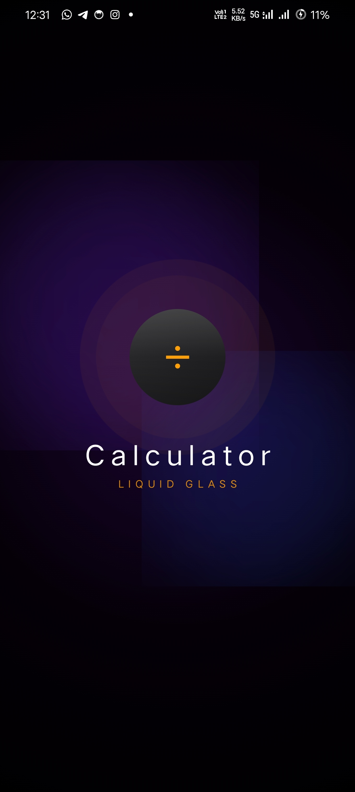
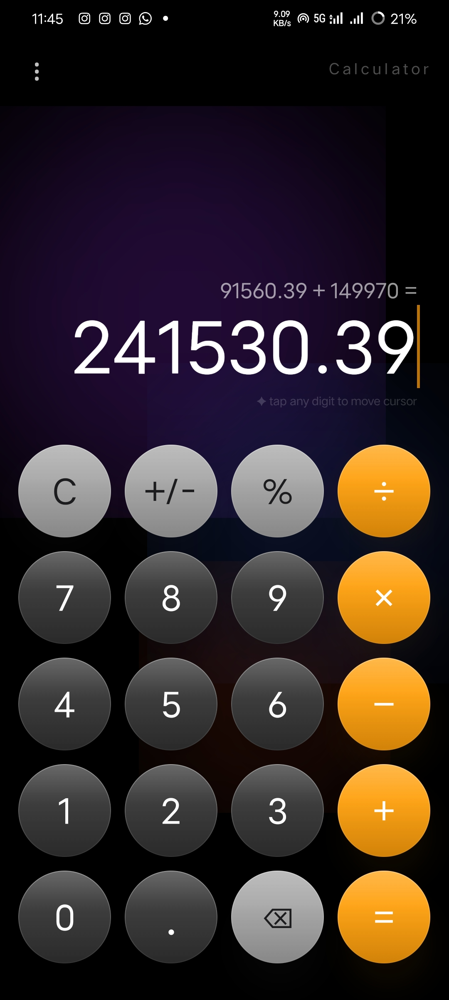
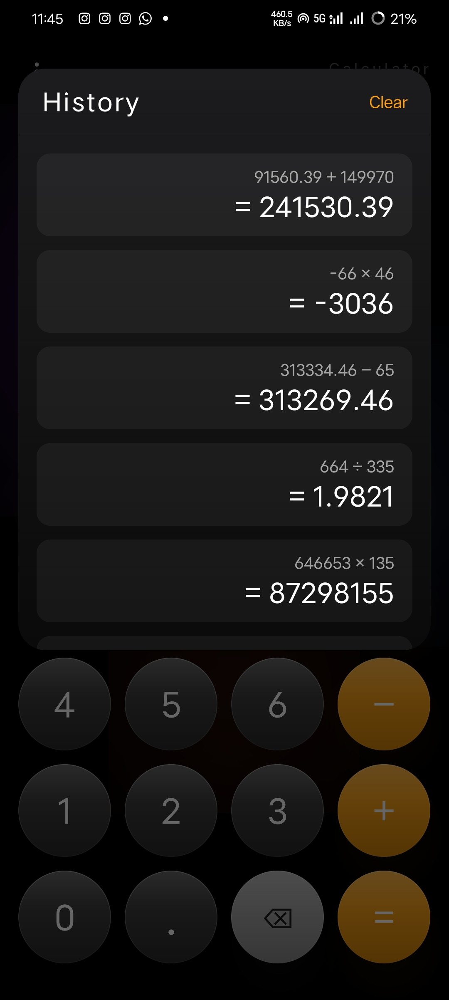

<div align="center">

# 🔢 iCalculator
### Premium Liquid Glass Calculator for Android


</div>

---

## ✨ Features

- 🌊 **Liquid Glass UI** — Frosted glass buttons with shimmer and glow
- 🎨 **Animated Background** — Drifting purple, blue and orange ambient blobs
- 💫 **Spring Animations** — Every button press feels liquid and bouncy
- 📋 **Calculation History** — View and clear past calculations
- ✏️ **Cursor Editing** — Tap any digit to fix mistakes mid-number
- ⌫ **Backspace** — Delete at cursor position precisely
- 🌑 **Pure Dark Theme** — Deep black with colorful glow
- 🚀 **Animated Splash Screen** — Custom branded launch experience

---

## 🏗️ Architecture
```
iCalculator/
├── model/
│   └── CalculatorModel.kt
├── viewmodel/
│   └── CalculatorViewModel.kt
└── ui/
    ├── components/
    │   ├── CalcButton.kt
    │   ├── DisplayArea.kt
    │   └── HistorySheet.kt
    ├── screens/
    │   ├── SplashScreen.kt
    │   └── CalculatorScreen.kt
    └── theme/
        └── Color.kt
```

---

## 🛠️ Tech Stack

| Technology | Purpose |
|---|---|
|  Kotlin | Primary language |
|  Jetpack Compose | Declarative UI |
|  MVVM | Architecture pattern |
|  StateFlow | Reactive state |
|  Material 3 | Design system |
|  Splash Screen API | Launch screen |

---

## 📱 Screenshots

<div align="center">

| Splash Screen | Calculator | History |
|:---:|:---:|:---:|
|  |  |  |

</div>

---

## 🚀 Getting Started
```bash
git clone https://github.com/iamyasirqureshi/icalculator.git
```

1. Open in **Android Studio Hedgehog** or newer
2. Let **Gradle sync** complete
3. Run on device with **Min SDK 26**

---

## 👨‍💻 Author

**Yasir Qureshi**

🎓 Diploma CSE — Government Polytechnic Mumbai | 2024–25

🎓 B.Tech CSE — G H Raisoni College Pune | 2025–28

<a href="https://github.com/iamyasirqureshi"></a>
<a href="https://linkedin.com/in/yasirqureshi3158"></a>
<a href="mailto:yasirqureshi3158@gmail.com"></a>

---

<div align="center">

⭐ **Star this repo if you liked it!**

</div>
